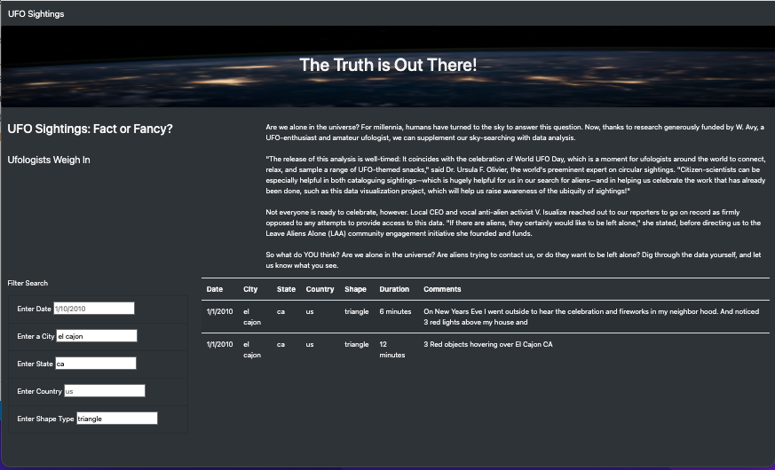
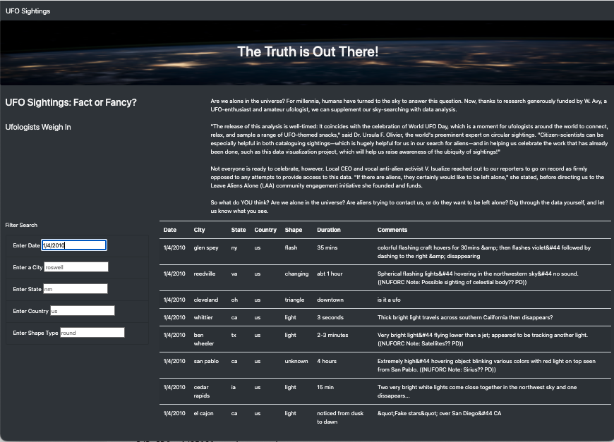

# UFO Sighting Webpage

## Overview
This project was developed to show how JavaScript can be implemented to create and interactive and dynamic webpage that allows users to interact with the page and get a customized view based on selects they make.  In this case a dataset of UFO sightings in North America in 2010 was used to display a table containing the information about the data, location and facts about the sightings.  To allow the user to customize the view of the data, inputs for the user to filter the table was incorporated into the HTML code and through JavaScript the table is filtered based on the values that the user enters.  To create this site the view was created using HTML and CSS and the table and filters used JavaScript to execute the required actions.

## Results
### Webpage layout and development
The UFO Sightings webpage will start with the complete list of UFO sightings contained in the data set.  The user can scroll through the information in the same manner they would in any webpage.  At the top is a header containing the title of the webpage and below that a brief introduction to the purpose of the page.  On the left of the table there is a number of sections that the user can use to filter the table.  The original iteration of the webpage contained only a single filter for the data of the observations contained in the data set.  By expanding the filters the user can choose to filter on one variable or any other number of filters for the criteria that the filters that were introduced.  The data is presented in a table to the right of the filters that can be scrolled through to view the files.  The table includes the column headings which correspond with the filters

Webpage Startup Screen

### User interaction
As mentioned above, the table of UFO sightings can be filtered based on specific criteria contained within the columns.  The place-holders in the filter input cells provide the user a guide for the data needed to filter within the selected column.  The user enters the filter value into the input box and hits enter to display the filtered table.  The user can continue to enter data into other filters or delete the value entered into the box to display the original dataset.

Webpage with Single Filter Applied

Webpage with Multiple Filters Applied

The website can be viewed at the following link [UFO Sightings](https://wattsr1.github.io/UFOs/).

## Summary

### Webpage interaction
This webpage shows how the use of JavaScript can make a webpage more dynamic and useful for users, making the online experience much more efficient and enjoyable.  This webpage shows how the user can manipulate a dataset easily by inputting criteria and customizing the view allowing the user to have control of their webpage interaction. The webpage allows the table to be filtered however as the user must have knowledge of the information contained in the webpage to actively filter the table.  For example, if the user wants to filter on a date, they must use trial and error determine what dates would show a sighting, or what city that a sighting was observed.  Additionally, the search values must exactly match the data contained in the table and is case-sensitive.  Again this requires the user to have knowledge of the values contained in the dataset. These factors make the webpage somewhat challenging for users to interact with.

### Suggested improvements
Thought the webpage is functional and delivers on the required elements to display and filter the dataset of UFO sightings some improvements could be made to make the site easier to use and interact with.  Below are a list of suggested improvements that would benefit the current version of the webpage.

1. Utilize dropdown lists containing the lists of the variables for each column in the table used in the filters.  This would remove the need to filter the table through trial and error and the accuracy of the information being entered for the filters.

2. Initiate a reset or refresh button to delete all the filters entered by the user.  In its current form the user must manually delete any filter entries or refresh the browser to go to the complete table.  This is a minor issue if only one filter is entered however if all the filters are filled out it is not as user-friendly.
